### Завдання 1
Завантажте дані

Створення схеми `pandemic` та вибір цієї схеми за замовчуванням

```sql
CREATE SCHEMA IF NOT EXISTS pandemic;
USE pandemic;
```

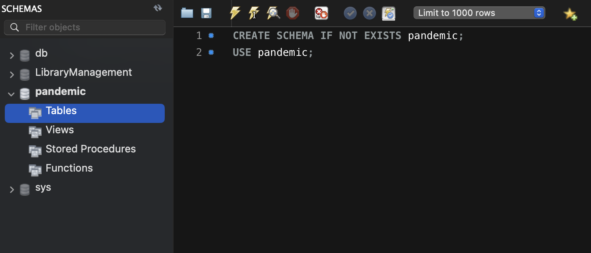

Імпорт даних за допомогою Import wizard та їх перегляд

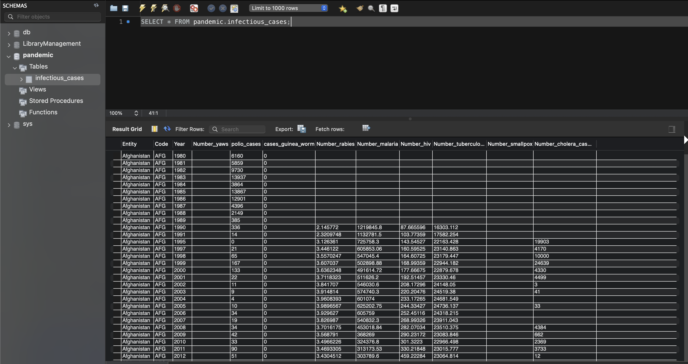


### Завдання 2
Нормалізація даних
Атрибути Entity та Code повторюються, тому можна створити дві таблиці:

 - entities — для унікальних значень Entity та Code.
 - infectious_data — для зберігання основних даних із посиланням на таблицю entities.

Створення таблиці entities:
    
```sql
CREATE TABLE entities (
    id INT AUTO_INCREMENT PRIMARY KEY,
    entity_name VARCHAR(255),
    entity_code VARCHAR(10)
);
```

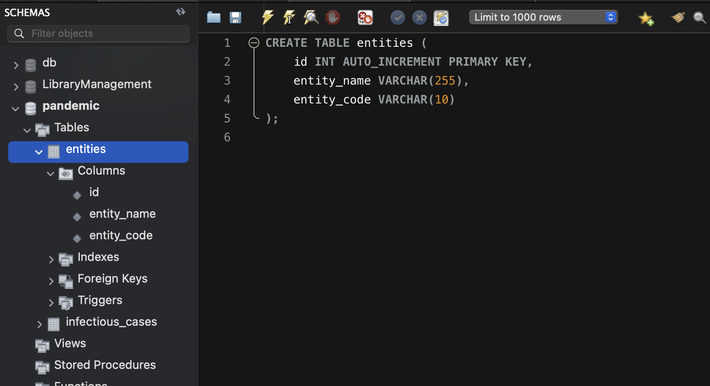

Наповнення таблиці entities:
    
```sql
INSERT INTO entities (entity_name, entity_code)
SELECT DISTINCT Entity, Code
FROM infectious_cases;
```

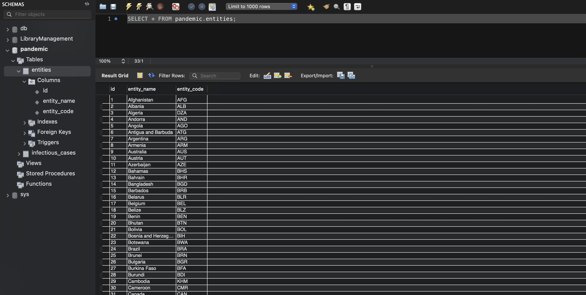

Створення таблиці infectious_data:

```sql
CREATE TABLE infectious_data (
    id INT AUTO_INCREMENT PRIMARY KEY,
    entity_id INT,
    year INT,
    number_yaws FLOAT,
    polio_cases INT,
    cases_guinea_worm FLOAT,
    number_rabies FLOAT,
    number_malaria FLOAT,
    number_hiv FLOAT,
    number_tuberculosis FLOAT,
    number_smallpox FLOAT,
    number_cholera_cases FLOAT,
    FOREIGN KEY (entity_id) REFERENCES entities(id)
);
```

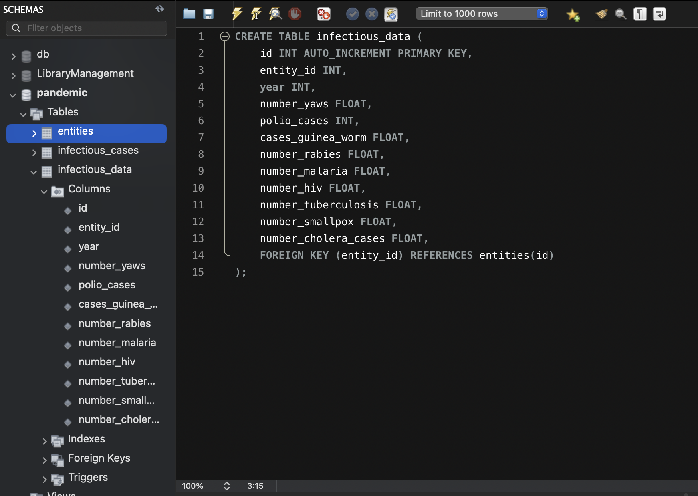

Наповнення таблиці infectious_data:

```sql
INSERT INTO infectious_data (
    entity_id, year, number_yaws, polio_cases, cases_guinea_worm, 
    number_rabies, number_malaria, number_hiv, number_tuberculosis, 
    number_smallpox, number_cholera_cases
)
SELECT 
    e.id, 
    ic.Year, 
    NULLIF(ic.Number_yaws, '') AS number_yaws,
    NULLIF(ic.polio_cases, '') AS polio_cases,
    NULLIF(ic.cases_guinea_worm, '') AS cases_guinea_worm,
    NULLIF(ic.Number_rabies, '') AS number_rabies,
    NULLIF(ic.Number_malaria, '') AS number_malaria,
    NULLIF(ic.Number_hiv, '') AS number_hiv,
    NULLIF(ic.Number_tuberculosis, '') AS number_tuberculosis,
    NULLIF(ic.Number_smallpox, '') AS number_smallpox,
    NULLIF(ic.Number_cholera_cases, '') AS number_cholera_cases
FROM infectious_cases ic
JOIN entities e ON ic.Entity = e.entity_name;
```

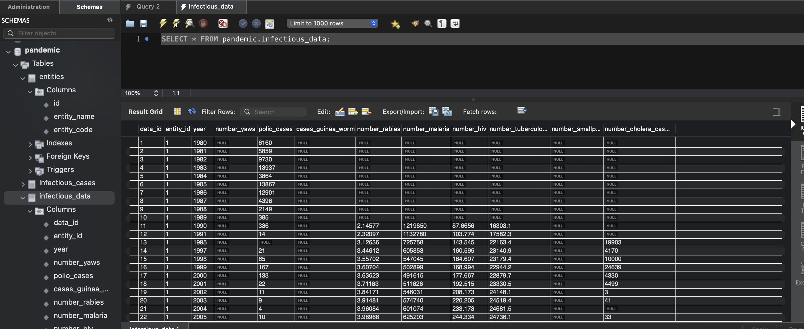

Після нормалізації даних тепер можна прияняти рішення стосовно таблиці `infectious_cases`:
1. Залишити infectious_cases як резервну копію та перейменувати

```sql
RENAME TABLE infectious_cases TO infectious_cases_backup;
```

2. Видалити таблицю infectious_cases

```sql
DROP TABLE infectious_cases;
```

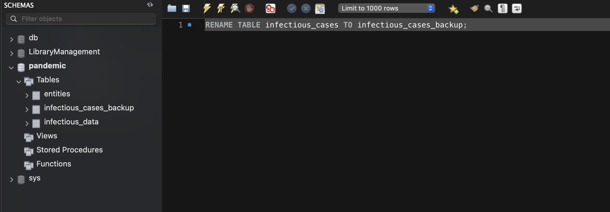


### Завдання 3
Аналіз даних
За допомогою `NULLIF` порожні значення ('') в Number_rabies вже були замінені на NULL під час наповнення таблиці infectious_data
У випадку, якщо б це не було зроблено, можна було б використати наступний запит:

```sql
UPDATE infectious_data
SET number_rabies = NULLIF(number_rabies, '');
```

Обчислення середнього, мінімального, максимального значень та суми
    
```sql
SELECT 
    e.entity_name,
    e.entity_code,
    AVG(d.number_rabies) AS avg_rabies,
    MIN(d.number_rabies) AS min_rabies,
    MAX(d.number_rabies) AS max_rabies,
    SUM(d.number_rabies) AS sum_rabies
FROM 
    infectious_data d
JOIN 
    entities e ON d.entity_id = e.id
WHERE 
    d.number_rabies IS NOT NULL
GROUP BY 
    e.entity_name, e.entity_code
ORDER BY 
    avg_rabies DESC
LIMIT 10;
```

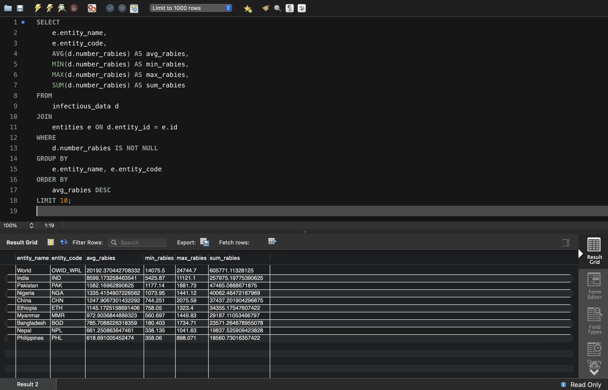

### Завдання 4
Побудуйте колонку різниці в роках.

```sql
SELECT 
    Year AS original_year,
    CONCAT(Year, '-01-01') AS first_january_date,
    CURDATE() AS cur_date,
    TIMESTAMPDIFF(YEAR, CONCAT(Year, '-01-01'), CURDATE()) AS year_difference
FROM 
    infectious_data;
```

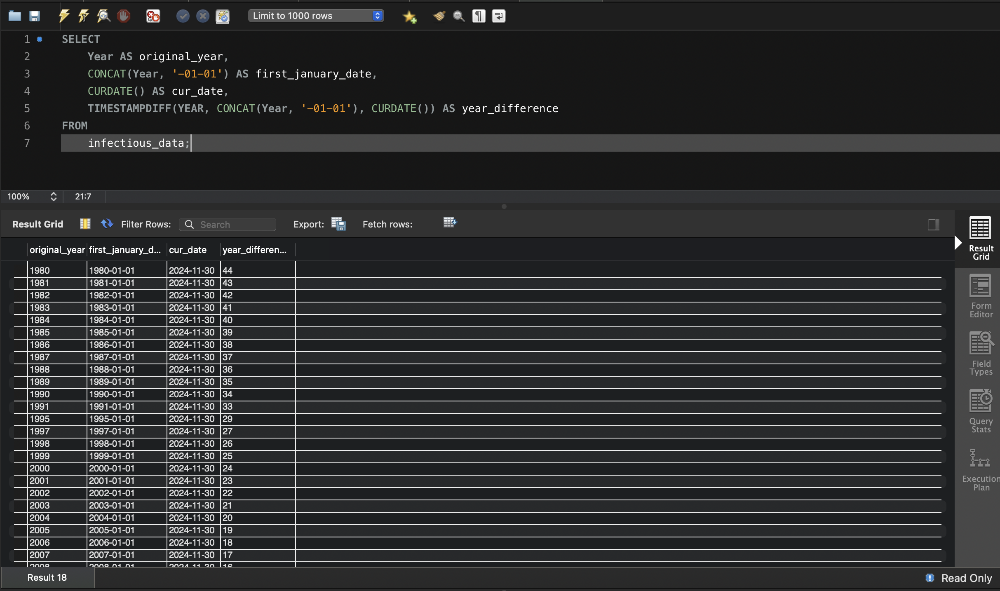

### Завдання 5
Побудуйте власну функцію.

__Функція для обчислення різниці в роках.__

Створення функції `calculate_year_difference`:

```sql
DELIMITER //

CREATE FUNCTION calculate_year_difference(input_year INT)
RETURNS INT
DETERMINISTIC
BEGIN
    DECLARE input_date DATE;
    DECLARE year_diff INT;

    -- Створення дати з року
    SET input_date = STR_TO_DATE(CONCAT(input_year, '-01-01'), '%Y-%m-%d');

    -- Обчислення різниці в роках між поточною датою та згенерованою датою
    SET year_diff = TIMESTAMPDIFF(YEAR, input_date, CURRENT_DATE);

    RETURN year_diff;
END //

DELIMITER ;
```

Використання функції `calculate_year_difference`:

```sql
SELECT 
    year AS original_year,
    calculate_year_difference(year) AS year_difference
FROM 
    infectious_data
WHERE 
    year IS NOT NULL;
```

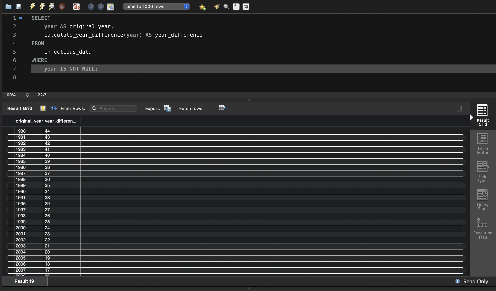

__Функція для розрахунку кількості захворювань за певний період.__

Створення функції `calculate_cases_per_period`:

```sql
DELIMITER //

CREATE FUNCTION calculate_cases_per_period(total_cases FLOAT, divisor INT)
RETURNS FLOAT
DETERMINISTIC
BEGIN
    -- Перевірка, чи дільник більший за 0, щоб уникнути ділення на нуль
    IF divisor <= 0 THEN
        RETURN NULL;
    END IF;

    RETURN total_cases / divisor;
END //

DELIMITER ;
```

Використання функції `calculate_cases_per_period`:

```sql
SELECT 
    e.entity_name AS entity_name,
    d.year AS year,
    d.number_rabies AS total_cases,
    calculate_cases_per_period(d.number_rabies, 12) AS cases_per_month,
    calculate_cases_per_period(d.number_rabies, 4) AS cases_per_quarter,
    calculate_cases_per_period(d.number_rabies, 2) AS cases_per_half_year
FROM 
    infectious_data d
JOIN 
    entities e ON d.entity_id = e.id
WHERE 
    d.number_rabies IS NOT NULL;
```

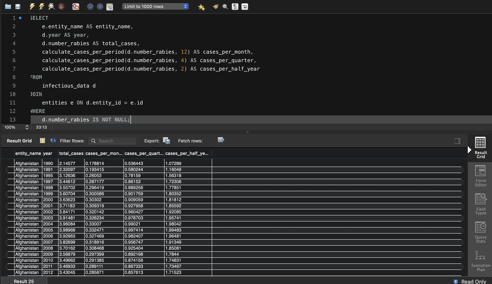
